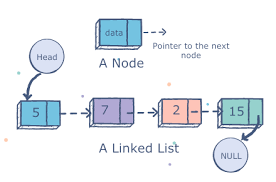
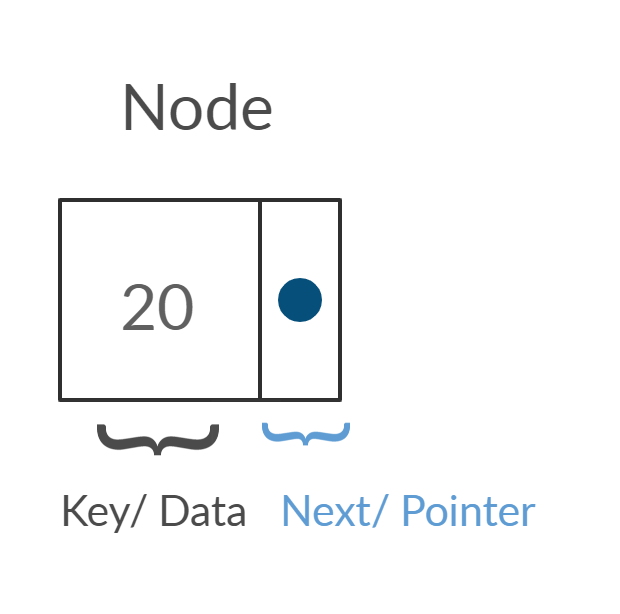
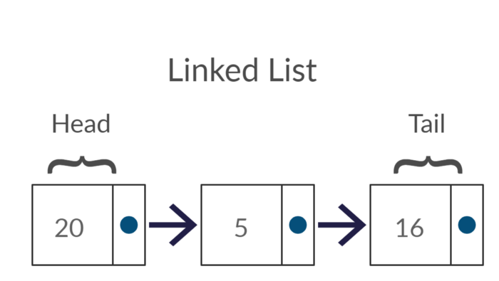
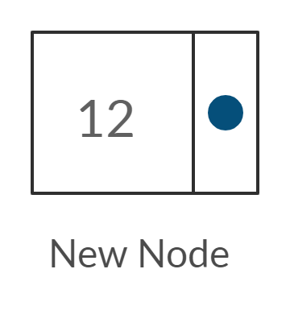
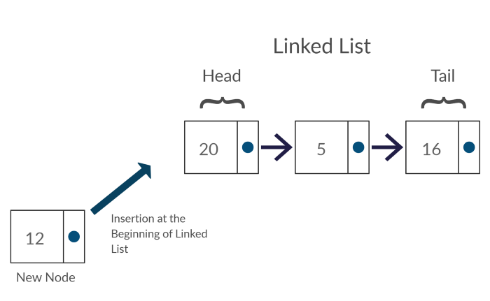
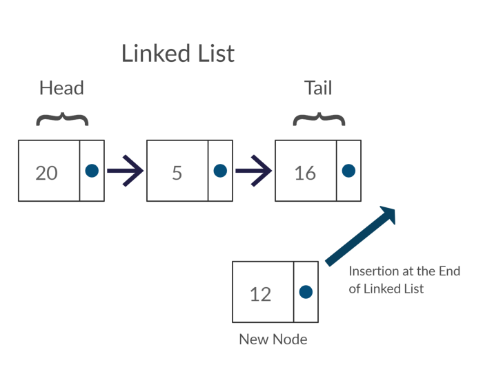
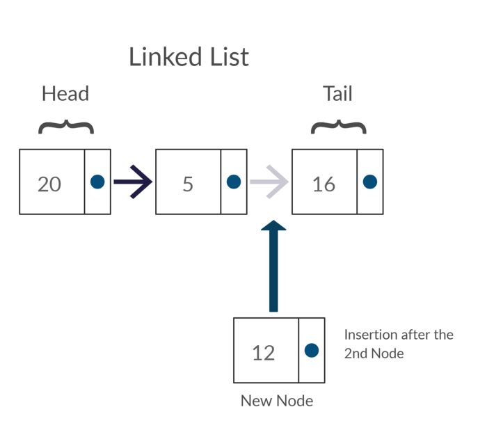
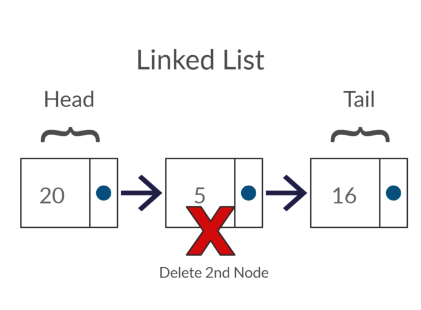

# What is a Linked List?

Linked List is nothing but a collection of elements called Nodes. It’s that simple!!

A node is a very simple object with just two properties. A variable to store data and another variable to store the memory address of the next node in the list. If you look at the below image, each node contains a data known as a key and a pointer which points to the address of the successive node known as next. Head is a special name given to the first node of a list, while Tail is a special name given to the last node of a linked list.

A node only knows about what data it contains, and who its neighbour is.



What’s so special about linked list is that it is a linear data structure where the position of the node does not determine the location where it is stored in the memory. As I explained above, the memory location of the successive node is stored in the current node. Which means that Linked Lists are dynamic — you can add or remove nodes from your linked list while your program is running.

## Linear Data Structures

A linear data structure traverses the data elements sequentially, in which only one data element can directly be reached. In other words, you can travel along a linear data structure in one direction by accessing each element one by one — nodes in linked lists.

Let’s summarize what we have learned up to now.

### Summary
* Elements in a linked list are known as nodes.
* Each node contains a data(key) and a pointer to its successor node, known as next.
* The attribute named head points to the first element of the linked list.
* The last element of the linked list is known as the tail.

## Creating a Node




```
public class Node<E> {
    private E key;
    private Node next;

    public Node(E data){
        key = data;
        next = null;
    }

    public E getKey() {
        return key;
    }

    public void setKey(E key) {
        this.key = key;
    }

    public Node getNext() {
        return next;
    }

    public void setNext(Node<E> next) {
        this.next = next;
    }

    public String toString(){
        return key.toString();
    }
}
    
```

Let’s analyze the above-written code. We initially create a class called Node and provide it with two properties required by any node as we learned at the beginning of this article. The integer variable called key is where the data is stored. For simplicity, we are only storing integers in our nodes. But keep in mind that you are free to use any data type. The next variable is of type Node. What this basically means is that it stores the memory location of an object type Node and thereby allowing you to access it.

Now we have successfully created the basic building block of a Linked List.

### Creating a Linked List



```
public class SinglyLinkedList<E> implements LinkedList<E> {

    private Node<E> headNode;
    
	...
    @Override
    public Boolean isEmpty() {
        return headNode == null;
    }
    
    ...
```

That was simple, wasn’t it? We simply created a Linked List with a head Node and initialized it as null in the constructor. We also have a method to check whether the Linked List is empty. This method simply checks whether the head is null or not.

As we have created our very own Linked Lists, let’s see how we can perform basic operations given below on Linked Lists.

### Basic Operations


Following are the basic operations supported by a linked list.

* Insertion − Adds an element at the beginning of the linked list.
* Deletion − Deletes an element from the linked list.
* Search − Searches an element using the given key.

### Insertion

We have to modify our Linked List class now.

Insertion can take place in three different ways.

* Insertion at the beginning of the Linked List
* Insertion at the end of the Linked List
* Insertion after a given node



### Insertion at the beginning of the Linked List



```
    public Node<E> insertAtBeginning(E object) {
        Node<E> node = new Node<>(object);
        node.setNext(headNode);
        headNode = node;
        return node;
    }
    
```

### Insertion at the end of the Linked List



```
    @Override
    public Node<E> insertAtEnd(E object) {
        Node<E> node = new Node(object);
        if(headNode == null){
            headNode = node;
            return node;
        }

        Node<E> last = headNode;
        while(last.getNext() != null){
            last = last.getNext();
        }

        last.setNext(node);
        return node;
    }
```

### Insertion after a given node




* Try this one yourself

### Search

We can search for a certain key in a linked list by traversing along the nodes in a linked list.

```
    @Override
    public Boolean contains(E key) {
        Node temp = headNode;
        while (temp != null){
            if(temp.getKey() == key){
                return true;
            }
            temp = temp.getNext();
        }
        return false;
    }
```

# Deletion

We can delete a node based on its position in the linked list. In order to succeed, we should traverse along the linked list to our desired position and then delete the node.




```
    @Override
    public Boolean remove(E key) {
        Node currentNode = headNode;
        Node nextNode = currentNode.getNext();
        while (currentNode != null){
            if(currentNode.getKey() == key){
                return true;
            }
            currentNode = currentNode.getNext();
            if(currentNode != null)
                nextNode = currentNode.getNext();
        }
        return false;
    }
```

